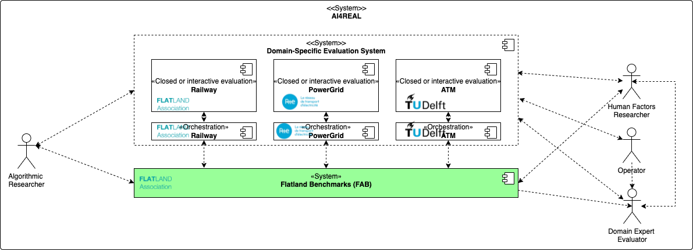
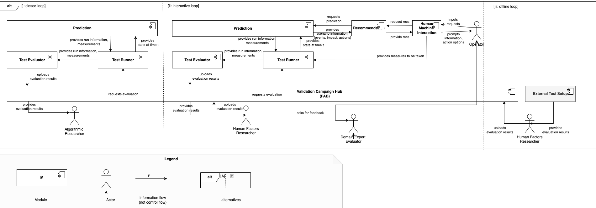
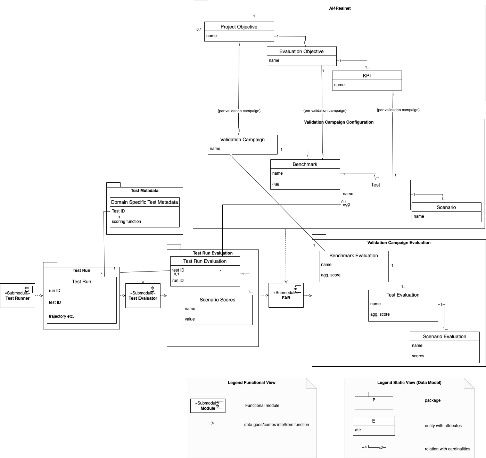

Flatland Benchmarks
===================
[](https://github.com/flatland-association/flatland-benchmarks/actions/workflows/checks.yml)

Flatland Benchmarks (FAB) is an open-source web-based platform for running Benchmarks to foster Open Research aiming at:

| Goal                                               | Description                                                                                                                                                                                                  | How does FAB contribute?                                                                                                                                               |
|----------------------------------------------------|--------------------------------------------------------------------------------------------------------------------------------------------------------------------------------------------------------------|------------------------------------------------------------------------------------------------------------------------------------------------------------------------|
| **Open access** and **open data**                  | research results and gained knowledge are accessible and can be used by anyone for applications or as the basis further research                                                                             | the web-based platform is open to researchers, developers, data scientists and domain experts, enabling to access and interpret data, problem formulations and results |
| **Open source software**  and **open peer review** | allow for the replication and reproducibility of research as well as for the reuse of data and software in other research projects, empowering anyone to contribute to and accelerating the pace of research | participants disclose their code and the leaderboard links to papers, code and discussion                                                                              |
| **Open community**                                 | enables collaborative formulation of problems and research questions, bringing in the expertise of various domains and fostering interdisciplinary approaches                                                | platform and problem formulations are made open and the community can contribute                                                                                       |

It supports both

* closed-loop: the evaluation is carried out human in the loop
* interactive-loop: the evaluation is carried by a human Operator interacting with a UI

evaluation.

## FAB Scope and Context



More details, see [ARCHITECTURE.md](docs/ARCHITECTURE.md).

## Building Block View



More details, see [ARCHITECTURE.md](docs/ARCHITECTURE.md).

## Data Model



More details, see [ARCHITECTURE.md](docs/ARCHITECTURE.md).

📦 TL; DR;
----------
To participate, or even organize your own benchmarks or competitions, you don't need to install anything, you just need to sign in an instance of the platform (e.g. this one). If you wish to configure your own instance of the platform, here are the instructions:

```shell

```

📑 Documentation
----------------

* [User's Guide](docs/USER_GUIDE.md) User documentation for benchmark participants and benchmark administrators.
* [Contributing](docs/CONTRIBUTING.md) Contributions are welcome! See how.
* [Architecture](docs/ARCHITECTURE.md) Get a technical overview of the platform and the design decisions.
* [Administrator's Guide](docs/ADMINISTRATION.md) Documentation for technical platform admins.
* [Developer's Guide](docs/DEVELOPMENT.md) Documentation for platform developers.

💬 Communication
----------------

* [Issue Tracker](https://github.com/flatland-association/flatland-benchmarks/issues/)
