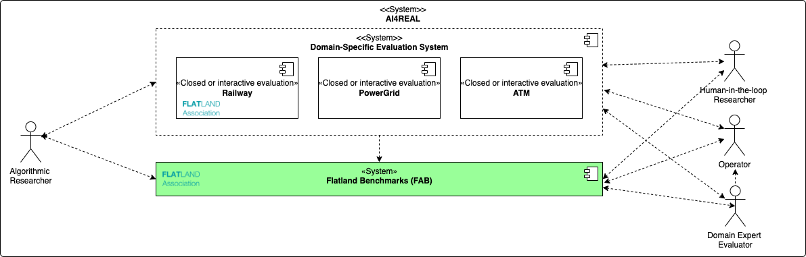

Flatland Benchmarks
===================
[](https://github.com/flatland-association/flatland-benchmarks/actions/workflows/checks.yml)

Flatland Benchmarks (FAB) is an open-source web-based platform for running Benchmarks to foster Open Research aiming at:

| Goal                                               | Description                                                                                                                                                                                                  | How does FAB contribute?                                                                                                                                               |
|----------------------------------------------------|--------------------------------------------------------------------------------------------------------------------------------------------------------------------------------------------------------------|------------------------------------------------------------------------------------------------------------------------------------------------------------------------|
| **Open access** and **open data**                  | research results and gained knowledge are accessible and can be used by anyone for applications or as the basis further research                                                                             | the web-based platform is open to researchers, developers, data scientists and domain experts, enabling to access and interpret data, problem formulations and results |
| **Open source software**  and **open peer review** | allow for the replication and reproducibility of research as well as for the reuse of data and software in other research projects, empowering anyone to contribute to and accelerating the pace of research | participants disclose their code and the leaderboard links to papers, code and discussion                                                                              |
| **Open community**                                 | enables collaborative formulation of problems and research questions, bringing in the expertise of various domains and fostering interdisciplinary approaches                                                | platform and problem formulations are made open and the community can contribute                                                                                       |

It supports both

* closed-loop: the evaluation is carried out human in the loop
* interactive-loop: the evaluation is carried by a human Operator interacting with a UI

evaluation.

## FAB Scope and Context

The FAB system is supposed to support validation campaigns in two modes

* FAB-internal evaluation: domain-specific evaluation systems are managed and spawned by FAB
* FAB-external evaluation: evaluation is performed externally to FAB, the results are uploaded to FAB either manually or via a technical interface by the FAB-external evaluation system.



Arrows represent control flow.
Both, FAB-internal and FAB-external evaluation, can be closed-loop or interactive-loop (see above).

| System/Role                                 | Description                                                                                                                                                                                                                                                              |
|---------------------------------------------|--------------------------------------------------------------------------------------------------------------------------------------------------------------------------------------------------------------------------------------------------------------------------|
| FAB                                         | central hub for validation campaign evaluation results. Entry-point for FAB-internal evaluation.                                                                                                                                                                         |
| External Domain-Specific Evaluation Systems | run FAB-external evaluations.                                                                                                                                                                                                                                            |
| Algorithmic Researcher                      | requests simulation for scenario and analyses scenario outcome, either from FAB (FAB-internal evaluation) or Domain-Specific Evaluation System (FAB-external evaluation)                                                                                                 |
| Human-in-the-Loop Researcher                | requests simulation for scenario and analyses run information or measurements,                                                                                                                                                                                           |
| Operator                                    | interacts with UI (issuing requests to based on information or action options from) either FAB (FAB-internal evaluation) or Domain-Specific Evaluation System (FAB-external evaluation).                                                                                 |
| Domain Expert Evaluator                     | anylyses scenario outcomes, either from FAB (FAB-internal evaluation) or Domain-Specific Evaluation System (FAB-external evaluation), or uploads scenario outcomes to FAB from FAB-external evaluations. Domain Expert Evaluator may interview Operators for evaluation. |

## Building Block View

The following [building block view](https://docs.arc42.org/section-5/) shows the static decomposition of the system into building blocks (modules, components, subsystems, classes, interfaces, packages, libraries, frameworks, layers, partitions, tiers, functions, macros, operations, data structures, …) as well as their dependencies (relationships, associations, …)


Arrows represent flow of information (and not control flow).

This building block view conceptually reflects closed-loop or interactive-loop, both of FAB-internal and FAB-external evaluation (ignoring FAB system boundary, i.e. whether the domain-specific evaluation systems are managed by FAB or external).

| Component            | Responsibility                                                                                                                            |
|----------------------|-------------------------------------------------------------------------------------------------------------------------------------------|
| FAB Web+Backend      | Manage scenarios for FAB-internal evaluation. Manage validation campgains and results for both FAB-internal and FAB-external evaluation.  |
| Simulation Engine    | E.g. FAB Flatland 3 compute worker and or InteractiveAI Services                                                                          |
| Digital Environment  | E.g. Flatland, Grid2Ops.                                                                                                                  |
| AI Agent             | E.g. a Flatland 3 competition solution taking actions on the Flatland environment based on observations and rewards from the environment. |
| Evaluation Submodule | E.g. FAB Flatland 3 evaluator.                                                                                                            |
| UI                   | E.g. Interactive AI Frontend                                                                                                              |

## Data Model

Inspired by [LIPS](https://github.com/IRT-SystemX/LIPS), high-level data model is as follows:


In words:

* The simulation engine produces run information/measurements, referring to a scenario. The exact contents are domain-specific. In the railway domain, these are the actions taken by the action and the rewards given by the environment. In the power grid case, these are observations and predictions.
* The evaluation submodule has an evaluation. It may also have scenario-specific metadata (e.g. ground truth for prediction into the future problems). In the railway domain, the evaluation module aggregates the rewards along different simulation steps and episodes.
* The output of the evaluation submodule is in a generic form referring to a scenario and the simulation engine run: it contains metrics values grouped by categories.
* Validation campaigns can be defined in the FAB hub: per domain (power grid, ATM, railway), weights and thresholds are defined for individual metrics and per category.

| Level                      | Validation                                                                                                                           |
|----------------------------|--------------------------------------------------------------------------------------------------------------------------------------|
| Validation Campaign        | <ul><li>succeeded yes or no (iff all domain validation campaigns succeed)</li></ul>                                                  |
| Domain Validation Campaign | <ul><li>succeeded yes or no (iff threshold met)</li><li>diff to threshold</li><li>weighted value</li><li>...</li></ul>               |
| Metrics Category           | <ul><li>succeeded yes or no (iff threshold met)</li><li>diff to threshold</li><li>weighted value</li><li>...</li></ul>               |
| Metrics                    | <ul><li>succeeded yes or no (iff threshold met)</li><li>diff to threshold</li><li>weighted value</li><li>value</li><li>...</li></ul> |

📦 TL; DR;
----------
To participate, or even organize your own benchmarks or competitions, you don't need to install anything, you just need to sign in an instance of the platform (
e.g. this one). If you wish to configure your own instance of the platform, here are the instructions:

```shell

```

📑 Documentation
----------------

* [User's Guide](docs/USER_GUIDE.md) User documentation for benchmark participants and benchmark administrators.
* [Contributing](docs/CONTRIBUTING.md) Contributions are welcome! See how.
* [Architecture](docs/ARCHITECTURE.md) Get a technical overview of the platform and the design decisions.
* [Administrator's Guide](docs/ADMINISTRATION.md) Documentation for technical platform admins.
* [Developer's Guide](docs/DEVELOPMENT.md) Documentation for platform developers.

💬 Communication
----------------

* [Issue Tracker](https://github.com/flatland-association/flatland-benchmarks/issues/)
