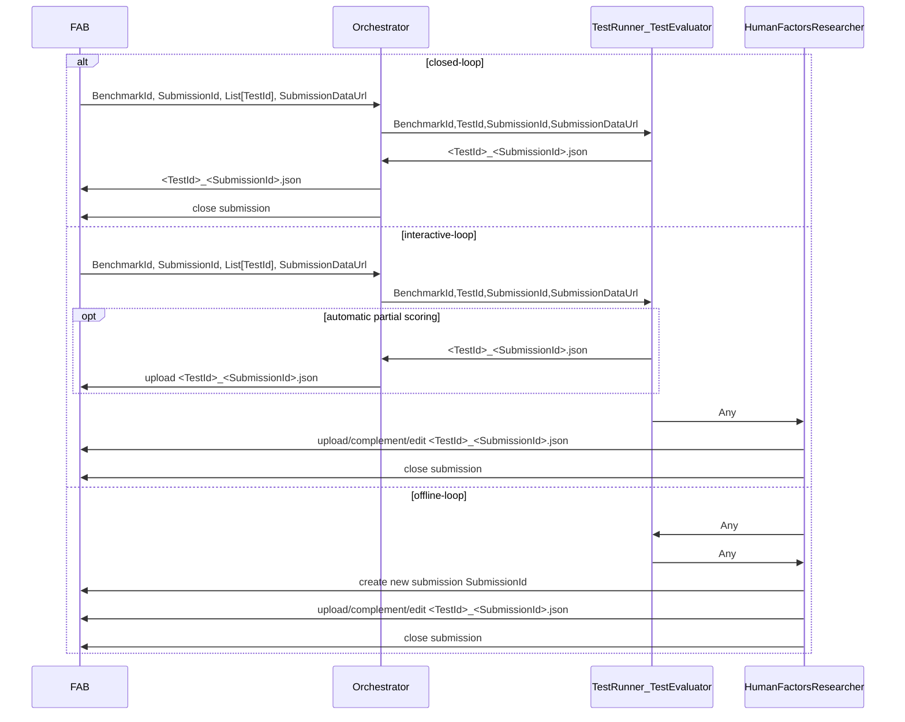

# AI4REALNET Validation Campaign Hub Orchestrator

AI4REALNET Campaign Hub Orchestrator integrates with Validation Campaign Hub (aka. FAB).

This repo contains:

- blueprint for domain-specific orchestrators
- FAB Client Lib to upload results from Python code in the orchestrator
- the domain-specific orchestrator and test runner implementations

## Organization and Responsibilities

1. The campaign benchmarks are set up in the Validation Campaign Hub by domain-specific project managers (TU Delft, RTE, Manuel Meyer) together with FLATLAND IT administrator.
2. The domain-specific orchestrators are configured and deployed by the domain-specific IT administrators: see `orchestrator.py` in the blueprint
3. Experiments (Test Runners, Test Evaluator) are implemented by KPI Owners: see `test_runner_evaluator.py` in the blueprint.
4. Experiments are carried out by Algorithmic Researchers, Human Factors Researchers and results are uploaded as a submission to FAB.

## Experiment Workflows

* **offline-loop**: manually upload your test results (JSON) via
  * FAB UI
  * FAB REST API using Python FAB Client Lib
* **closed-loop**:
  * Algorithmic Researcher starts experiment from hub
  * Orchestrator uploads results (JSON) to hub and closes submission
* **interactive-loop**:  manually upload your test results (JSON) via
  * Human Factors Researcher starts experiment from hub
  * orchestrator uploads results (JSON) to hub
  * Human Factors Researcher complements submission manually via FAB UI or Python CLI
  * Human Factors Researcher closes submission manually

## Architecture

Arrows indicate information flow and not control flow.



## TL;DR;

### Start Domain-Specific Orchestrator for Interactive-Loop and Closed-Loop Experiments

In your domain-specific infrastructure:

TODO number of parallel workers? https://docs.celeryq.dev/en/stable/reference/cli.html#celery-worker
TODO requirement.txt
TODO extract to repo

```shell
export BROKER_URL
export BACKEND_URL
python -m celery -A tasks worker -l info -n compute-worker@%n --soft-time-limit  600 --time-limit 720
```

### Upload your Results to Campaign Hub with Python FAB Client Lib

```shell
cat results.json

curl -X PUT .... 
```
