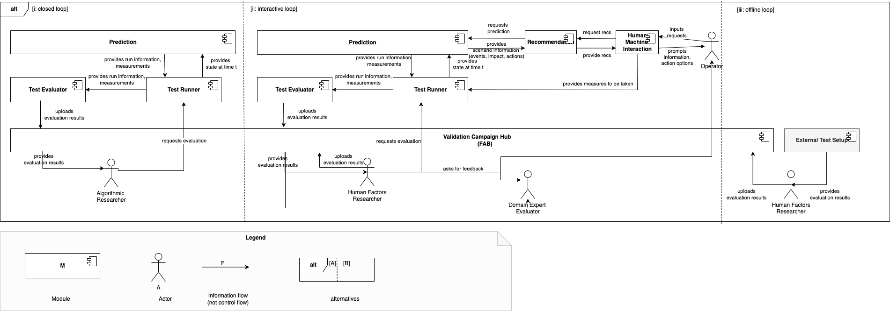
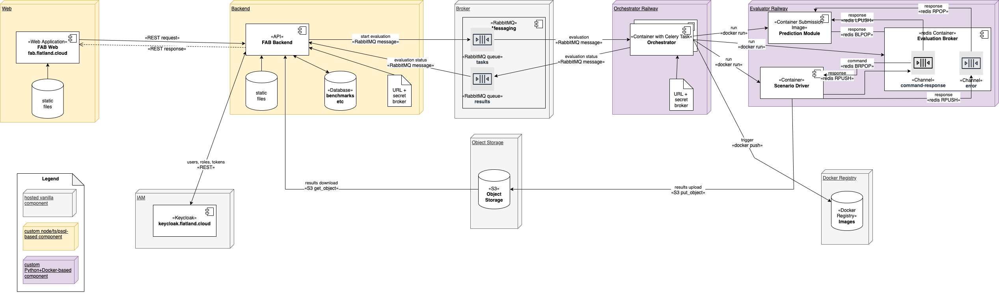

# Flatland Benchmarks Architecture Overview

**About arc42**

arc42, the template for documentation of software and system
architecture.

Template Version 8.2 EN. (based upon AsciiDoc version), January 2023

Created, maintained and © by Dr. Peter Hruschka, Dr. Gernot Starke and
contributors. See <https://arc42.org>.

<div class="note">

This version of the template contains some help and explanations. It is
used for familiarization with arc42 and the understanding of the
concepts. For documentation of your own system you use better the
*plain* version.

</div>

# Introduction and Goals

Describes the relevant requirements and the driving forces that software
architects and development team must consider. These include

- underlying business goals,

- essential features,

- essential functional requirements,

- quality goals for the architecture and

- relevant stakeholders and their expectations

## Requirements Overview

<div class="formalpara-title">

**Contents**

</div>

Short description of the functional requirements, driving forces,
extract (or abstract) of requirements. Link to (hopefully existing)
requirements documents (with version number and information where to
find it).

<div class="formalpara-title">

**Motivation**

</div>

From the point of view of the end users a system is created or modified
to improve support of a business activity and/or improve the quality.

<div class="formalpara-title">

**Form**

</div>

Short textual description, probably in tabular use-case format. If
requirements documents exist this overview should refer to these
documents.

Keep these excerpts as short as possible. Balance readability of this
document with potential redundancy w.r.t to requirements documents.

See [Introduction and Goals](https://docs.arc42.org/section-1/) in the
arc42 documentation.

## Quality Goals

<div class="formalpara-title">

**Contents**

</div>

The top three (max five) quality goals for the architecture whose
fulfillment is of highest importance to the major stakeholders. We
really mean quality goals for the architecture. Don’t confuse them with
project goals. They are not necessarily identical.

Consider this overview of potential topics (based upon the ISO 25010
standard):


<div class="formalpara-title">

**Motivation**

</div>

You should know the quality goals of your most important stakeholders,
since they will influence fundamental architectural decisions. Make sure
to be very concrete about these qualities, avoid buzzwords. If you as an
architect do not know how the quality of your work will be judged…

<div class="formalpara-title">

**Form**

</div>

A table with quality goals and concrete scenarios, ordered by priorities

## Stakeholders

<div class="formalpara-title">

**Contents**

</div>

Explicit overview of stakeholders of the system, i.e. all person, roles
or organizations that

- should know the architecture

- have to be convinced of the architecture

- have to work with the architecture or with code

- need the documentation of the architecture for their work

- have to come up with decisions about the system or its development

<div class="formalpara-title">

**Motivation**

</div>

You should know all parties involved in development of the system or
affected by the system. Otherwise, you may get nasty surprises later in
the development process. These stakeholders determine the extent and the
level of detail of your work and its results.

<div class="formalpara-title">

**Form**

</div>

Table with role names, person names, and their expectations with respect
to the architecture and its documentation.

| Role/Name   | Contact        | Expectations       |
|-------------|----------------|--------------------|
| *\<Role-1>* | *\<Contact-1>* | *\<Expectation-1>* |
| *\<Role-2>* | *\<Contact-2>* | *\<Expectation-2>* |

# Architecture Constraints

<div class="formalpara-title">

**Contents**

</div>

Any requirement that constraints software architects in their freedom of
design and implementation decisions or decision about the development
process. These constraints sometimes go beyond individual systems and
are valid for whole organizations and companies.

<div class="formalpara-title">

**Motivation**

</div>

Architects should know exactly where they are free in their design
decisions and where they must adhere to constraints. Constraints must
always be dealt with; they may be negotiable, though.

<div class="formalpara-title">

**Form**

</div>

Simple tables of constraints with explanations. If needed you can
subdivide them into technical constraints, organizational and political
constraints and conventions (e.g. programming or versioning guidelines,
documentation or naming conventions)

See [Architecture Constraints](https://docs.arc42.org/section-2/) in the
arc42 documentation.

# Context and Scope

> [!NOTE]  Context and scope - as the name suggests - delimits your system (i.e. your scope) from all its communication partners (neighboring systems and your scope) from all its communication partners (neighboring systems and users, i.e. the context of your system). It thereby specifies the external interfaces.
> The FAB system is supposed to support validation campaigns in two modes

* FAB-internal evaluation: domain-specific evaluation systems are managed and spawned by FAB
* FAB-external evaluation: evaluation is performed externally to FAB, the results are uploaded to FAB either manually or via a technical interface by the FAB-external evaluation system.


Arrows represent control flow.
Both, FAB-internal and FAB-external evaluation, can be closed-loop or interactive-loop (see above). Offline-loop is always FAB-external.

| System/Role                                 | Description                                                                                                                                                                                                                                                              |
|---------------------------------------------|--------------------------------------------------------------------------------------------------------------------------------------------------------------------------------------------------------------------------------------------------------------------------|
| FAB                                         | central hub for validation campaign evaluation results. Entry-point for FAB-internal evaluation.                                                                                                                                                                         |
| External Domain-Specific Evaluation Systems | run FAB-external evaluations.                                                                                                                                                                                                                                            |
| Algorithmic Researcher                      | requests simulation for scenario and analyses scenario outcome, either from FAB (FAB-internal evaluation) or Domain-Specific Evaluation System (FAB-external evaluation)                                                                                                 |
| Human-in-the-Loop Researcher                | requests simulation for scenario and analyses run information or measurements,                                                                                                                                                                                           |
| Operator                                    | interacts with HMI, issuing requests to HMI based on information or action options from HMI.                                                                                                                                                                             |
| Domain Expert Evaluator                     | analyses scenario outcomes, either from FAB (FAB-internal evaluation) or Domain-Specific Evaluation System (FAB-external evaluation), or uploads scenario outcomes to FAB from FAB-external evaluations. Domain Expert Evaluator may interview Operators for evaluation. |

## Business Context

<div class="formalpara-title">

**Contents**

</div>

Specification of **all** communication partners (users, IT-systems, …)
with explanations of domain specific inputs and outputs or interfaces.
Optionally you can add domain specific formats or communication
protocols.

<div class="formalpara-title">

**Motivation**

</div>

All stakeholders should understand which data are exchanged with the
environment of the system.

<div class="formalpara-title">

**Form**

</div>

All kinds of diagrams that show the system as a black box and specify
the domain interfaces to communication partners.

Alternatively (or additionally) you can use a table. The title of the
table is the name of your system, the three columns contain the name of
the communication partner, the inputs, and the outputs.

**\<Diagram or Table>**

**\<optionally: Explanation of external domain interfaces>**

## Technical Context

The following [Architecture Diagram](https://mermaid.js.org/syntax/architecture) shows the interplay of the FAB components:


| Component             | Description                                                                                                       | Technical                         |
|-----------------------|-------------------------------------------------------------------------------------------------------------------|-----------------------------------|
| Frontend              | Web pages for managing, viewing and uploading campaign results/competition submissions                            | Node, JS, HTML                    |
| Backend               | Campaign/competition/benchmark metadata and results                                                               | REST, Node, JS, HTML              |
| Database              | Metadata and results store                                                                                        | PostgreSQL                        |
| Broker                | Message queues for triggering evaluation and signalling status between backend and domain-specific orchestrators. | RabbitMQ                          |
| IAM                   | Identity Access Management for backend services: users and groups                                                 | Keycloak                          |
| Orchestrator Domain A | Manages pool of evaluation workers                                                                                | Blueprint: Celery                 |
| Evaluator Domain A    | Evaluation worker.                                                                                                | Blueprint: Python + bash + Docker |
| Object Storage        | Raw tabular results are uploaded to object storage from evaluator and fetched by backend.                         | AWS S3 compatible object storage  |

And the following [information flow diagram](https://www.uml-diagrams.org/information-flow-diagrams.html) additionally reflects closed-loop or interactive-loop, both of FAB-internal and FAB-external evaluation (ignoring FAB system boundary, i.e. whether the domain-specific evaluation systems are managed by FAB or external).



### Level 1 Components

| Component             | Responsibility                                                                                                                           | Example                                                                          |
|-----------------------|------------------------------------------------------------------------------------------------------------------------------------------|----------------------------------------------------------------------------------|
| FAB Web+Backend       | Manage scenarios for FAB-internal evaluation. Manage validation campaigns and results for both FAB-internal and FAB-external evaluation. | FAB                                                                              |
| Prediction Module     | Step from state at time t.                                                                                                               | Flatland 3 environment                                                           |
| Scenario Driver       | Hooks into simulation engine to provide state at time t (en lieu of production information system) for validation purposes.              |                                                                                  |
| Scenario Evaluator    | Evaluate scenario outcome for validation purposes.                                                                                       | FAB Flatland 3 evaluator (conceptually computing metrics/KPIs on the trajectory) |
| Evaluation Submodule  | Provide prediction for specified scenario.                                                                                               |                                                                                  |
| Recommendation Module | Provide recommendation to HMI.                                                                                                           |                                                                                  |
| HMI Module            | Provide information and action options to Operator.                                                                                      | Interactive AI Frontend  with Flatland event services                            |

### Level 2 Components

| Component           | Responsibility                                                                                     | Example                                                                 |
|---------------------|----------------------------------------------------------------------------------------------------|-------------------------------------------------------------------------|
| Simulation Engine   | Run simulation for state and scenario, brokering actions between AI agent and digital environment. | FAB Flatland 3 evaluator stepping the env with actions from submission. |
| Digital Environment | Update state based on actions (step).                                                              | Flatland 3 env, Grid2Ops                                                |
| AI Agent            | Provide actions based on observations from state                                                   | FAB Flatland 3 submission                                               |

> [!IMPORTANT]  
> Arrows indicate the direction of information flow and not direction of calls!

# Solution Strategy

<div class="formalpara-title">

**Contents**

</div>

A short summary and explanation of the fundamental decisions and
solution strategies, that shape system architecture. It includes

- technology decisions

- decisions about the top-level decomposition of the system, e.g.
  usage of an architectural pattern or design pattern

- decisions on how to achieve key quality goals

- relevant organizational decisions, e.g. selecting a development
  process or delegating certain tasks to third parties.

<div class="formalpara-title">

**Motivation**

</div>

These decisions form the cornerstones for your architecture. They are
the foundation for many other detailed decisions or implementation
rules.

<div class="formalpara-title">

**Form**

</div>

Keep the explanations of such key decisions short.

Motivate what was decided and why it was decided that way, based upon
problem statement, quality goals and key constraints. Refer to details
in the following sections.

See [Solution Strategy](https://docs.arc42.org/section-4/) in the arc42
documentation.

# Building Block View

### Level 1

> [!NOTE]
> [building block view](https://docs.arc42.org/section-5/) shows the static decomposition of the system into building blocks (modules, components, subsystems, classes, interfaces, packages, libraries, frameworks, layers, partitions, tiers, functions, macros, operations, data structures, …) as well as their dependencies (relationships, associations, …)

The following diagram shows the building blocks in the Flatland 3 benchmarking closed loop:



Implementation:

* closed-loop: backend polls broker, fetches results from S3 and uploads results via SCORES API
* interactive or offline loop: results uploaded manually via SCORES REST API

### Level 2

Inspired by [LIPS](https://github.com/IRT-SystemX/LIPS), high-level data model is as follows:


Here's an overview of the aggregation in Pseudo-SQL style. More details below in API description.

* A submission is always with respect to a benchmark.
* Raw result data is always with respect to submission and scenario.
* Benchmark definition contains
  * `f_t1`, `agg_t_1`: field `f_t1` of scenarios s1,..,s3 is aggregated by function `agg_t_1` into field `agg_field_t1`
  * `f_b1`, `agg_b_1`: field `f_b1` of tests t1,t2 is aggregated by function `agg_b_1` into field `agg_field_b1`
* Available aggregation functions: `SUM`, `NANSUM`, (weighted or equal weights if undefined) `MEAN`, (weighted or equal weights if undefined) `NANMEDIAN`, `MEDIAN`, `NANMEDIAN`


### API Roles

- `user`: can submit and view results
- `admin`: can define benchmarks
- `results-uploader`: can upload results (for all benchmarks)

### Setups

| ↕️️ aspect / ↔️️setup                         | benchmarking                                | competition                                 | campaign                                             |
|-----------------------------------------------|---------------------------------------------|---------------------------------------------|------------------------------------------------------|
| loop                                          | closed-loop                                 | closed-loop                                 | closed/interactive/offline loop                      |
| submission                                    | any number of tests                         | all tests                                   | single test                                          |
| results uploader                              | technical user with `results-uploader` role | technical user with `results-uploader` role | technical or human user with `results-uploader` role |
| user default roles                            | `user`                                      | `user`                                      | `user`, `results-uploader` (dedicate FAB instance)   |
| top-level overview                            | benchmarks                                  | benchmarks                                  | campaigns                                            |
| benchmark overview                            | rounds -> benchmark leaderboard per round   | rounds -> benchmark leaderboard per round   | ❌                                                    |
| campaign overview                             | ❌                                           | ❌                                           | benchmarks (row=benchmark)                           |
| leaderboard (row=submission, benchmark score) | ✅                                           | ✅                                           | ❌                                                    |
| benchmark drilldown (row=test)                | ✅                                           | ✅                                           | ✅                                                    |
| test drilldown (row=scenario)                 | ✅                                           | ✅                                           | ✅                                                    |

### Interface 1: Benchmark definition API

* `PUT /benchmarks`: create benchmark (JSON does not contain IDs)
* `DELETE /benchmarks/{benchmark_id}`: delete benchmark
* `GET /benchmarks/{benchmark_id}`: get benchmark definition (incl. generated IDs)
* `POST /benchmarks/{benchmark_id}`: update existing benchmark definition (unreferenced tests/scenarios will be removed from the benchmark and left dangling)
* `POST /tests/{test_id}`: same at test level
* `POST /scenarios/{scenario_id}`: same at scenario level
* `DELETE /tests/{test_id}/`: remove one test from the benchmark definition
* `DELETE /scenarios/{scenario_id}`: remove one scenario from the test definition

Optional:

* `PUT /tests/{test_id}/scenarios`: add scenario(s) under test
* `PUT /benchmarks/{benchmark_id}/tests`: add test(s) under benchmark

Format:

```json
{
  "tests": [
    {
      "test_id": "00",
      "fields": [
        {
          "name": "rewards",
          "agg_func": "SUM",
          "agg_field": "rewards",
          "description": "primary score"
        },
        {
          "name": "mean_done",
          "agg_func": "MEAN_NAN",
          "agg_field": "done",
          "description": "mean percentage done"
        }
      ],
      "scenarios": [
        {
          "scenario_id": "00",
          "fields": [
            {
              "name": "rewards",
              "description": "Rewards [-]"
            },
            {
              "name": "runtime",
              "description": "Runtime [s]"
            },
            {
              "name": "done",
              "description": "Percentage done [%]"
            }
          ]
        }
      ]
    }
  ],
  "fields": [
    {
      "name": "rewards",
      "agg_func": "SUM",
      "agg_field": "rewards",
      "description": "primary score"
    },
    {
      "name": "mean_done",
      "agg_func": "MEAN_NAN",
      "agg_field": "done",
      "description": "mean percentage done"
    }
  ]
}
```

Add/delete individual scenarios:

Remarks:

* `{ "definition": ...}` allows for future backwards-compatible addition of optional attributes
* `fields` defines tabular or form view of results at the hierarchy level (benchmark/test/scenario)
* `agg_func` must be one of a pre-defined enum of values e.g. `sum`, `mean`, `nanmean` etc.
* handling of nan-values depends on the aggregation function, similar to numpy:
  * https://numpy.org/doc/stable/reference/generated/numpy.mean.html -> result is nan if values are missing are reported as nan
  * https://numpy.org/doc/stable/reference/generated/numpy.nanmean.html -> result is mean of non-nan values
* The definition must be consistent, i.e. `agg_field` must be one of the fields defined in the underlying elements.
* Versioning: we keep `valid_from` and `valid_to` to allow to for future revert operations.
* Note that we adhere to functional data processing paradigm: we re-process the data according to the current processing definition;
  the raw data is kept on S3 and we could in principle re-process cached data at every level from S3 to the UI.
* Scenario IDs are global IDs, not only relative to their parent benchmark/test.

| Aggregation function | weights allowed | Description                                                                                                                              |
|----------------------|-----------------|------------------------------------------------------------------------------------------------------------------------------------------|
| `SUM`                | yes             | If one value is NaN, the sum will be NaN. Empty sum defaulting to 0.                                                                     |
| `NANSUM`             | yes             | Sum over all non-NaN scores. Empty sum defaulting to 0.                                                                                  |
| `MEAN`               | yes             | If one value is NaN, the mean will be NaN. Empty mean defaulting to NaN. If weights are present, then the mean is weighted mean.         |
| `NANMEAN`            | yes             | Mean over all non-NaN scores, defaulting to 0.  Empty nanmean defaulting to NaN. If weights are present, then the mean is weighted mean. |
| `MEDIAN`             | no              | If one value is NaN, the median will be NaN, defaulting to 0. Empty median defaulting to NaN.                                            |
| `NANMEDIAN`          | no              | Median over all non-NaN scores, defaulting to 0. Empty nanmedian defaulting to NaN.                                                      |

Relational schema:


Note:

* We assume the `agg_field` to be the same for all children.
*

### Interface 1b: Benchmark group definition API

* `PUT /benchmark_groups`: create benchmark group
* `POST /benchmark_groups/{benchmark_group_id}`: create validation campaign/competition/benchmark with the list of the underlying benchmarks
* `DELETE /benchmark_groups/{benchmark_group_id}`: delete idem
* `GET /benchmark_groups/{benchmark_group_id}`: retrieve list of benchmarks in this group along with metadata (type, campaign name/competition name); different UI dependening on type


Remarks:

* General model grouping
* multiple benchmarks as rounds of the same competition
* multiple benchmarks as evaluation objects of the same validation campaign
* different evolutions/flavours/objectives of a benchmark under the same common heading
* The UI might be different in the different setups, but not necessarily so:
  * tabs for different rounds of a competition or different versions of a benchmark
  * table with different benchmarks of a validation campaign
  * no tabs if a benchmark has only one version
* If a definition is updated, we lazily assume results already uploaded still comply with the updated definition - upon aggregation, the UI might display NaN where data is missing. We assume the definition is validated at the begin of a campaign.

Open Questions:

* We might implement `SETUP` without enumeration, but with a UI configuration instead.

### Interface 2: Submission and results APIs

* `PUT /submissions`: create a submission with initial status and owner
* `GET /submissions/{submission_id}`: status and owner of a submission
* `POST /submissions/{submission_id}/status`: update status or make public of a submission

* `GET /results/submission/{submission_id}/scenario/{scenario_id}`: raw scores of submission for single scenario
* `POST /results/submission/{submission_id}/scenario/{scenario_id}`: live update for single scenario

* `GET /results/submission/{submission_id}/tests/{test_id}`: aggregated scores of submission for single test
* `POST /results/submission/{submission_id}/tests/{test_id}`: batch upload for subset of scenarios of a single test (scenarios not included will be NaN)

* `GET /results/submission/{submission_id}/benchmarks/{benchmark_id}`: aggregated scores of submission for single benchmark
* `POST /results/submission/{submission_id}/benchmarks/{benchmark_id}`: batch upload for subset of tests of a single benchmark

* `GET /results/benchmark_group/{benchmark_group}?num_submissions`: get benchmarks with their num_submissions best submission(s)
* `GET /results/benchmark/{benchmark_id}`: get submissions ordered by primary benchmark score (leaderboard in competition and benchmarks settings)
* `GET /results/test/{test_id}`: get submissions ordered by primary test score
* `GET /results/scenario/{scenario_id}`: get submissions ordered by primary scenario score

Format:

```json
{
  "data": [
    {
      "test_id": "00",
      "scores": [
        {
          "scenario_id": 55,
          "reward": -93,
          "runtime": 53.35,
          "done": 0.3
        }
      ]
    }
  ],
  "submission_id": "a98adsf989vaadfs9898"
}
```

```json
{
  "data": [
    {
      "scenario_id": 55,
      "reward": -93,
      "runtime": 53.35,
      "done": 0.3
    }
  ],
  "submission_id": "a98adsf989vaadfs9898"
}
```

Remarks:

* An uploader can be a user or a group. Let's start with only users.
* `{"data": ...}` allows for future backwards-compatible addition of optional attributes, like submitting on behalf of a group.
* Partial results (aka. live update): Same evaluation during evaluations as afterwards: goes over benchmark/test definition and all scenarios below; missing values interpreted as nan; whether intermediate result is nan or an intermediate value depends on aggregation (e.g. `nansum` vs. `sum`).
* Store only the raw results, do the aggregation upon GET request of the aggregated scores, either in backend (preferred) or (if implementation much simpler) in frontend
* The campaign setup does not use the full-benchmark scores API.

Constraints:

* all fields defined in `SCENARIO_DEFINITION` must be present
* all scenarios defined in `SCENARIO_DEFINITION` must be present

Relational schema (multi-key-value based, i.e. multiple "raw" scores per scenario possible):


Future extensions:

* `SUBMISSION_VERSIONS`: allows to group submissions with a version in order to re-use same description/heading for the same team/submitter:


### Interface 3: RabbitMQ

```json
{
  "benchmark": 1,
  "submission_image": "ghcr.io/flatland-association/fab-flatland-submission-template:latest",
  "code_repository": "",
  "tests": [
    1,
    2,
    3,
    4,
    5,
    6,
    7,
    8,
    9,
    10,
    11,
    12,
    13,
    14,
    15
  ]
}
```

### &dagger; Interface 2: Redis result structure

There is currently no generic abstraction for the result structure.

The redis result for Flatland 3 has the following JSON structure:

```json
{
  "f3-evaluator": {
    "job_status": "Complete",
    "image_id": "ghcr.io/flatland-association/fab-flatland-evaluator@sha256:035327826cdad082bdcc072ca484639123545c332c447c57de4376e3fe77dd26",
    "log": "<plaintext log from pod run>",
    "job": {
      "@see": "https://kubernetes.io/docs/reference/kubernetes-api/workload-resources/job-v1/"
    },
    "pod": {
      "@see": "https://kubernetes.io/docs/reference/kubernetes-api/workload-resources/pod-v1/"
    },
    "results.csv": "filename,test_id,env_id,n_agents,x_dim,y_dim,n_cities,max_rail_pairs_in_city,n_envs_run,seed,grid_mode,max_rails_between_cities,malfunction_duration_min,malfunction_duration_max,malfunction_interval,speed_ratios,reward,normalized_reward,percentage_complete,steps,simulation_time,nb_malfunctioning_trains,nb_deadlocked_trains,controller_inference_time_min,controller_inference_time_mean,controller_inference_time_max\nTest_0/Level_0.pkl,Test_0,Level_0,5,25,25,2,2,2,1,False,2,20,50,0,{1.0: 1.0},-140.0,0.4285714285714286,0.0,49.0,0.12987303733825684,0.0,0.0,3.314018249511719e-05,4.022462027413505e-05,6.794929504394531e-05\nTest_0/Level_1.pkl,Test_0,Level_1,5,25,25,2,2,2,2,False,2,20,50,250,{1.0: 1.0},-104.0,0.48,0.0,40.0,0.33571386337280273,0.0,2.0,3.314018249511719e-05,4.0233804938498525e-05,6.794929504394531e-05\nTest_1/Level_0.pkl,Test_1,Level_0,2,30,30,3,2,3,1,False,2,20,50,0,{1.0: 1.0},,,,,,,,,,\nTest_1/Level_1.pkl,Test_1,Level_1,2,30,30,3,2,3,2,False,2,20,50,300,{1.0: 1.0},,,,,,,,,,\nTest_1/Level_2.pkl,Test_1,Level_2,2,30,30,3,2,3,4,False,2,20,50,600,{1.0: 1.0},,,,,,,,,,\n",
    "results.json": "{\"state\": \"FINISHED\", \"progress\": 1.0, \"simulation_count\": 2, \"total_simulation_count\": 5, \"score\": {\"score\": 0.9085714285714286, \"score_secondary\": 0.0}, \"meta\": {\"normalized_reward\": 0.45429, \"termination_cause\": \"The mean percentage of done agents during the last Test (2 environments) was too low: 0.000 < 0.25\", \"reward\": -122.0, \"percentage_complete\": 0.0}}"
  },
  "f3-submission": {
    "job_status": "Complete",
    "image_id": "ghcr.io/flatland-association/fab-flatland-submission-template@sha256:e32d331729c16a871287ef8862c5d77de5028e50971e91bad754b6ed63f0806b",
    "log": "<plaintext log from pod run>",
    "job": {
      "@see": "https://kubernetes.io/docs/reference/kubernetes-api/workload-resources/job-v1/"
    },
    "pod": {
      "@see": "https://kubernetes.io/docs/reference/kubernetes-api/workload-resources/pod-v1/"
    }
  }
}
```

The two sub-JSONs for `f3-evaluator` and `f3-submission` have the following attributes:

| field          | description                            | data type                                                                                                                                                      |
|----------------|----------------------------------------|----------------------------------------------------------------------------------------------------------------------------------------------------------------|
| `job_status`   | status of the container/workload       | see [k8s job-v1/#JobStatus](https://kubernetes.io/docs/reference/kubernetes-api/workload-resources/job-v1/#JobStatus)                                          |
| `image_id`     | image ID of the container/workload     | URL                                                                                                                                                            |
| `log`          | log of the container/workload          | plaintext                                                                                                                                                      |
| `job`          |                                        | see [k8s job-v1/#Job](https://kubernetes.io/docs/reference/kubernetes-api/workload-resources/job-v1/#Job)                                                      |
| `pod`          |                                        | see [k8s pod-v1/#Pod](https://kubernetes.io/docs/reference/kubernetes-api/workload-resources/pod-v1/#Pod)                                                      |
| `results.csv`  | results (`f3-evaluator` only)          | string-exported csv results, see [`self.evaluation_metadata_df`](https://github.com/flatland-association/flatland-rl/blob/main/flatland/evaluators/service.py) |
| `results.json` | evaluation state (`f3-evaluator` only) | string-`dump`ed json results, see [`self.evaluation_state`](https://github.com/flatland-association/flatland-rl/blob/main/flatland/evaluators/service.py)      |

Here's an example of the `load`ed JSON from `results.json`:

```json
{
  "state": "FINISHED",
  "progress": 1.0,
  "simulation_count": 2,
  "total_simulation_count": 5,
  "score": {
    "score": 0.7117346938775511,
    "score_secondary": 0.2
  },
  "meta": {
    "normalized_reward": 0.35587,
    "termination_cause": "The mean percentage of done agents during the last Test (2 environments) was too low: 0.200 < 0.25",
    "reward": -141.5,
    "percentage_complete": 0.2
  }
}
```

Here's an example of the string-imported csv from `results.csv`:

```csv
filename,test_id,env_id,n_agents,x_dim,y_dim,n_cities,max_rail_pairs_in_city,n_envs_run,seed,grid_mode,max_rails_between_cities,malfunction_duration_min,malfunction_duration_max,malfunction_interval,speed_ratios,reward,normalized_reward,percentage_complete,steps,simulation_time,nb_malfunctioning_trains,nb_deadlocked_trains,controller_inference_time_min,controller_inference_time_mean,controller_inference_time_max
Test_0/Level_0.pkl,Test_0,Level_0,5,25,25,2,2,2,1,False,2,20,50,0,{1.0: 1.0},-138.0,0.43673469387755104,0.4,49.0,0.11057591438293457,0.0,0.0,3.409385681152344e-05,4.0399784944495365e-05,5.841255187988281e-05
Test_0/Level_1.pkl,Test_0,Level_1,5,25,25,2,2,2,2,False,2,20,50,250,{1.0: 1.0},-145.0,0.275,0.0,40.0,0.08973836898803711,0.0,0.0,3.409385681152344e-05,3.86907813254367e-05,5.841255187988281e-05
Test_1/Level_0.pkl,Test_1,Level_0,2,30,30,3,2,3,1,False,2,20,50,0,{1.0: 1.0},,,,,,,,,,
Test_1/Level_1.pkl,Test_1,Level_1,2,30,30,3,2,3,2,False,2,20,50,300,{1.0: 1.0},,,,,,,,,,
Test_1/Level_2.pkl,Test_1,Level_2,2,30,30,3,2,3,4,False,2,20,50,600,{1.0: 1.0},,,,,,,,,,
```

# Runtime View

<div class="formalpara-title">

**Contents**

</div>

The runtime view describes concrete behavior and interactions of the
system’s building blocks in form of scenarios from the following areas:

- important use cases or features: how do building blocks execute
  them?

- interactions at critical external interfaces: how do building blocks
  cooperate with users and neighboring systems?

- operation and administration: launch, start-up, stop

- error and exception scenarios

Remark: The main criterion for the choice of possible scenarios
(sequences, workflows) is their **architectural relevance**. It is
**not** important to describe a large number of scenarios. You should
rather document a representative selection.

<div class="formalpara-title">

**Motivation**

</div>

You should understand how (instances of) building blocks of your system
perform their job and communicate at runtime. You will mainly capture
scenarios in your documentation to communicate your architecture to
stakeholders that are less willing or able to read and understand the
static models (building block view, deployment view).

<div class="formalpara-title">

**Form**

</div>

There are many notations for describing scenarios, e.g.

- numbered list of steps (in natural language)

- activity diagrams or flow charts

- sequence diagrams

- BPMN or EPCs (event process chains)

- state machines

- …

See [Runtime View](https://docs.arc42.org/section-6/) in the arc42
documentation.

## \<Runtime Scenario 1>

- *\<insert runtime diagram or textual description of the scenario>*

- *\<insert description of the notable aspects of the interactions
  between the building block instances depicted in this diagram.>*

## \<Runtime Scenario 2>

## …

## \<Runtime Scenario n>

## Runtime Scenario Closed Loop

Arrow directions signify call direction.


(*) In campaign setting, this will be one results upload at test level (corresponding to one KPI). In competition settings, the results for the whole benchmark will be uploaded (multiple calls to test API or batch call). In benchmarking setting, this can be multiple test calls.
For live update, mutliple result uploads at scenario may also be possible.

## Runtime Scenario Interactive loop

Arrow directions signify call direction.


## Runtime Scenario Offline loop

Arrow directions signify call direction.


# Deployment View

<div class="formalpara-title">

**Content**

</div>

The deployment view describes:

1. technical infrastructure used to execute your system, with
   infrastructure elements like geographical locations, environments,
   computers, processors, channels and net topologies as well as other
   infrastructure elements and

2. mapping of (software) building blocks to that infrastructure
   elements.

Often systems are executed in different environments, e.g. development
environment, test environment, production environment. In such cases you
should document all relevant environments.

Especially document a deployment view if your software is executed as
distributed system with more than one computer, processor, server or
container or when you design and construct your own hardware processors
and chips.

From a software perspective it is sufficient to capture only those
elements of an infrastructure that are needed to show a deployment of
your building blocks. Hardware architects can go beyond that and
describe an infrastructure to any level of detail they need to capture.

<div class="formalpara-title">

**Motivation**

</div>

Software does not run without hardware. This underlying infrastructure
can and will influence a system and/or some cross-cutting concepts.
Therefore, there is a need to know the infrastructure.

Maybe a highest level deployment diagram is already contained in section
3.2. as technical context with your own infrastructure as ONE black box.
In this section one can zoom into this black box using additional
deployment diagrams:

- UML offers deployment diagrams to express that view. Use it,
  probably with nested diagrams, when your infrastructure is more
  complex.

- When your (hardware) stakeholders prefer other kinds of diagrams
  rather than a deployment diagram, let them use any kind that is able
  to show nodes and channels of the infrastructure.

See [Deployment View](https://docs.arc42.org/section-7/) in the arc42
documentation.

## Infrastructure Level 1

Describe (usually in a combination of diagrams, tables, and text):

- distribution of a system to multiple locations, environments,
  computers, processors, .., as well as physical connections between
  them

- important justifications or motivations for this deployment
  structure

- quality and/or performance features of this infrastructure

- mapping of software artifacts to elements of this infrastructure

For multiple environments or alternative deployments please copy and
adapt this section of arc42 for all relevant environments.

***\<Overview Diagram>***

Motivation  
*\<explanation in text form>*

Quality and/or Performance Features  
*\<explanation in text form>*

Mapping of Building Blocks to Infrastructure  
*\<description of the mapping>*

## Infrastructure Level 2

Here you can include the internal structure of (some) infrastructure
elements from level 1.

Please copy the structure from level 1 for each selected element.

### *\<Infrastructure Element 1>*

*\<diagram + explanation>*

### *\<Infrastructure Element 2>*

*\<diagram + explanation>*

…

### *\<Infrastructure Element n>*

*\<diagram + explanation>*

# Cross-cutting Concepts

<div class="formalpara-title">

**Content**

</div>

This section describes overall, principal regulations and solution ideas
that are relevant in multiple parts (= cross-cutting) of your system.
Such concepts are often related to multiple building blocks. They can
include many different topics, such as

- models, especially domain models

- architecture or design patterns

- rules for using specific technology

- principal, often technical decisions of an overarching (=
  cross-cutting) nature

- implementation rules

<div class="formalpara-title">

**Motivation**

</div>

Concepts form the basis for *conceptual integrity* (consistency,
homogeneity) of the architecture. Thus, they are an important
contribution to achieve inner qualities of your system.

Some of these concepts cannot be assigned to individual building blocks,
e.g. security or safety.

<div class="formalpara-title">

**Form**

</div>

The form can be varied:

- concept papers with any kind of structure

- cross-cutting model excerpts or scenarios using notations of the
  architecture views

- sample implementations, especially for technical concepts

- reference to typical usage of standard frameworks (e.g. using
  Hibernate for object/relational mapping)

<div class="formalpara-title">

**Structure**

</div>

A potential (but not mandatory) structure for this section could be:

- Domain concepts

- User Experience concepts (UX)

- Safety and security concepts

- Architecture and design patterns

- "Under-the-hood"

- development concepts

- operational concepts

Note: it might be difficult to assign individual concepts to one
specific topic on this list.


See [Concepts](https://docs.arc42.org/section-8/) in the arc42
documentation.

## *\<Concept 1>*

*\<explanation>*

## *\<Concept 2>*

*\<explanation>*

…

## *\<Concept n>*

*\<explanation>*

# Architecture Decisions

<div class="formalpara-title">

**Contents**

</div>

Important, expensive, large scale or risky architecture decisions
including rationales. With "decisions" we mean selecting one alternative
based on given criteria.

Please use your judgement to decide whether an architectural decision
should be documented here in this central section or whether you better
document it locally (e.g. within the white box template of one building
block).

Avoid redundancy. Refer to section 4, where you already captured the
most important decisions of your architecture.

<div class="formalpara-title">

**Motivation**

</div>

Stakeholders of your system should be able to comprehend and retrace
your decisions.

<div class="formalpara-title">

**Form**

</div>

Various options:

- ADR ([Documenting Architecture
  Decisions](https://cognitect.com/blog/2011/11/15/documenting-architecture-decisions))
  for every important decision

- List or table, ordered by importance and consequences or:

- more detailed in form of separate sections per decision

See [Architecture Decisions](https://docs.arc42.org/section-9/) in the
arc42 documentation. There you will find links and examples about ADR.

# Quality Requirements

<div class="formalpara-title">

**Content**

</div>

This section contains all quality requirements as quality tree with
scenarios. The most important ones have already been described in
section 1.2. (quality goals)

Here you can also capture quality requirements with lesser priority,
which will not create high risks when they are not fully achieved.

<div class="formalpara-title">

**Motivation**

</div>

Since quality requirements will have a lot of influence on architectural
decisions you should know for every stakeholder what is really important
to them, concrete and measurable.

See [Quality Requirements](https://docs.arc42.org/section-10/) in the
arc42 documentation.

## Quality Tree

<div class="formalpara-title">

**Content**

</div>

The quality tree (as defined in ATAM – Architecture Tradeoff Analysis
Method) with quality/evaluation scenarios as leafs.

<div class="formalpara-title">

**Motivation**

</div>

The tree structure with priorities provides an overview for a sometimes
large number of quality requirements.

<div class="formalpara-title">

**Form**

</div>

The quality tree is a high-level overview of the quality goals and
requirements:

- tree-like refinement of the term "quality". Use "quality" or
  "usefulness" as a root

- a mind map with quality categories as main branches

In any case the tree should include links to the scenarios of the
following section.

## Quality Scenarios

<div class="formalpara-title">

**Contents**

</div>

Concretization of (sometimes vague or implicit) quality requirements
using (quality) scenarios.

These scenarios describe what should happen when a stimulus arrives at
the system.

For architects, two kinds of scenarios are important:

- Usage scenarios (also called application scenarios or use case
  scenarios) describe the system’s runtime reaction to a certain
  stimulus. This also includes scenarios that describe the system’s
  efficiency or performance. Example: The system reacts to a user’s
  request within one second.

- Change scenarios describe a modification of the system or of its
  immediate environment. Example: Additional functionality is
  implemented or requirements for a quality attribute change.

<div class="formalpara-title">

**Motivation**

</div>

Scenarios make quality requirements concrete and allow to more easily
measure or decide whether they are fulfilled.

Especially when you want to assess your architecture using methods like
ATAM you need to describe your quality goals (from section 1.2) more
precisely down to a level of scenarios that can be discussed and
evaluated.

<div class="formalpara-title">

**Form**

</div>

Tabular or free form text.

# Risks and Technical Debts

<div class="formalpara-title">

**Contents**

</div>

A list of identified technical risks or technical debts, ordered by
priority

<div class="formalpara-title">

**Motivation**

</div>

“Risk management is project management for grown-ups” (Tim Lister,
Atlantic Systems Guild.)

This should be your motto for systematic detection and evaluation of
risks and technical debts in the architecture, which will be needed by
management stakeholders (e.g. project managers, product owners) as part
of the overall risk analysis and measurement planning.

<div class="formalpara-title">

**Form**

</div>

List of risks and/or technical debts, probably including suggested
measures to minimize, mitigate or avoid risks or reduce technical debts.

See [Risks and Technical Debt](https://docs.arc42.org/section-11/) in
the arc42 documentation.

# Glossary

<div class="formalpara-title">

**Contents**

</div>

The most important domain and technical terms that your stakeholders use
when discussing the system.

You can also see the glossary as source for translations if you work in
multi-language teams.

<div class="formalpara-title">

**Motivation**

</div>

You should clearly define your terms, so that all stakeholders

- have an identical understanding of these terms

- do not use synonyms and homonyms

A table with columns \<Term> and \<Definition>.

Potentially more columns in case you need translations.

See [Glossary](https://docs.arc42.org/section-12/) in the arc42
documentation.

| Term        | Definition        |
|-------------|-------------------|
| *\<Term-1>* | *\<definition-1>* |
| *\<Term-2>* | *\<definition-2>* |
