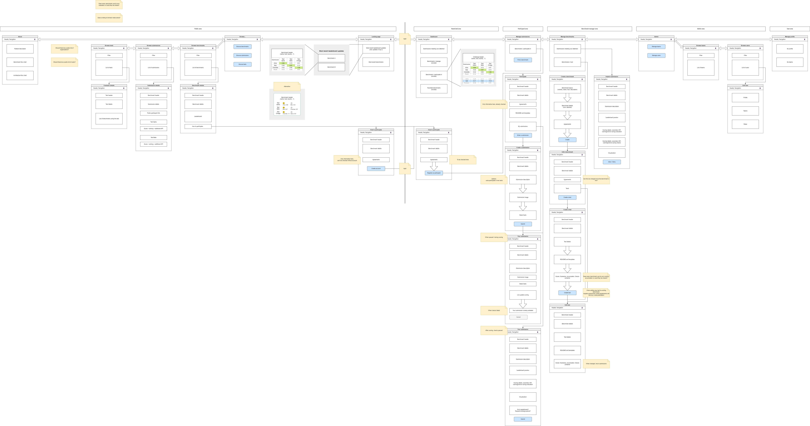
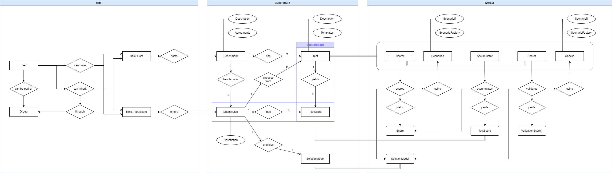

# Flatland Association Benchmarking Developer's Guide

> [!NOTE]  
> Documentation for platform developers.





## Recommended tools and setup

It is recommended to use [VSCode](https://code.visualstudio.com) with the [ESLint](https://marketplace.visualstudio.com/items?itemName=dbaeumer.vscode-eslint) and [Prettier](https://marketplace.visualstudio.com/items?itemName=esbenp.prettier-vscode) extensions installed.

[Node.js](https://nodejs.org) must be installed. It runs frontend and backend code as well as local scripts (e.g. `npx lint-staged` which will lint and format staged source files). Node.js includes npm, which is required to install node modules.

To complete your local setup, run
```bash
npm ci
```
in the project root folder. This will install all required node modules as listed in `package-lock.json`.

The project is configured to lint and format your source code before committing and also on explicit save (when using VSCode as described above). However, if you're not using VSCode or for some reason not using the extensions, your code will still be linted and formatted before a commit. Be aware that in this case lint warnings and errors will abort your commit!

>If `lint-staged` fails and **discards** your changes, you can often `git stash pop` them back into existence. Run the `lint` npm script manually beforehand or install the VSCode plugins as described above to limit any surprises.

## Developper notes

### dev.001 - GET list returns URIs instead of resources

API endpoints listing resources - such as GET `/bechmarks` - should only return list of URIs. The resources themselves are then fetched in consecutive requests. This enables effective caching on the client side and minimizes transmitted data load.

2025-01-24, Olivier Stuker

### dev.002 - GET resource returns array

API endpoints returning resources - such as GET `/benchmarks/1` - should always return an array of resources. That way, the response body type is always the same, no matter whether a single or multiple resources were queried at once.

2025-01-24, Olivier Stuker
