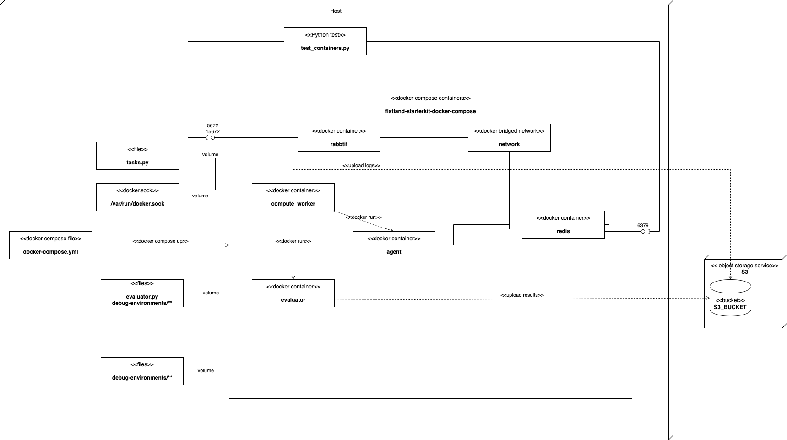
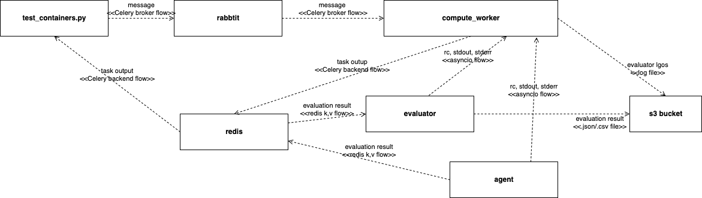
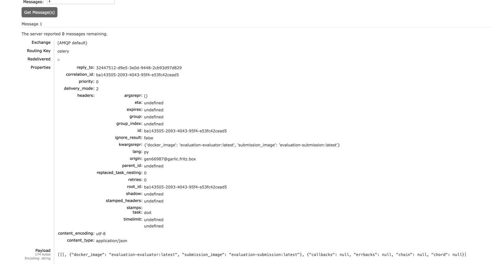
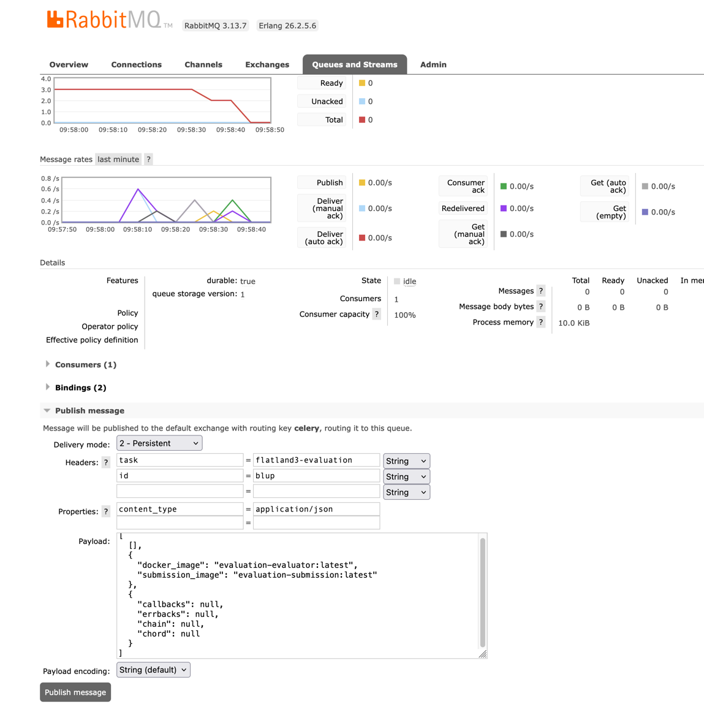

Evaluation
==========

This directory provides a `docker-compose.yml`
for [testing Flatland 3 submissions locally](https://flatland.aicrowd.com/challenges/flatland3/test-submissions-local.html#).

Its starting point was an integration of

* [flatland-starter-kit](https://gitlab.aicrowd.com/flatland/flatland-starter-kit.git/) and
* [codabench](https://github.com/codalab/codabench),

both from a conceptual and an implementation point of view.

## Architecture
Referring to [Information Flow](../docs/img/architecture/InformationFlow.drawio.png), it covers the components by running 7 services:

| Component           | Service                                                                                                                                                |
|---------------------|--------------------------------------------------------------------------------------------------------------------------------------------------------|
| Evaluation Queue    | `rabbitmq` send tasks to worker                                                                                                                        |
| Compute Worker Pool | `compute_worker` Celery worker, receives task and runs two containers `evaluator` and `agent`                                                          | 
| Evaluator           | `evaluator` waits for messages from agent                                                                                                              |
| Agent               | `agent` runs environments and sends messages to evaluator                                                                                              |
| Result Store        | `redis` kv store used for messaging                                                                                                                    |
| Evaluation Broker   | N.B. The same `redis` instance is used as Celery backend (`codabench`) and for communication between `agent` and `evaluator` (`flatland-starter-kit`). |
| (Flatland API)      | `submitter` simulates submission from portal by scheduling `compute_worker` task                                                                       |


### Deployment View



### Information Flow View

> [!IMPORTANT]  
> Arrows indicate the direction of information flow and not direction of calls!

The following [UML information flow diagram](https://www.uml-diagrams.org/information-flow-diagrams.html) shows the exchange of information between system components at high level:



It illustrates how to integrate

* [flatland-starter-kit](https://gitlab.aicrowd.com/flatland/flatland-starter-kit.git/)
* [codabench](https://github.com/codalab/codabench)

## TL;DR

1. Run

```shell
cd evaluation
docker compose up
```

2. In separate shell, run

```
cd evaluation/submitter
conda env update -f environment.yml
conda activate benchmarksubmitter 
python submitter.py
/ Start simulate submission from portal.....
\ End simulate submission from portal: rc=0, stdout=b...........
```

3. In previous shell, run

```
# CTRL-C and then
docker compose down
```

## Debunking Celery

Message sent via Celery library (`submitter.py`):



Manual triggering via RabbitMQ web triggers `compute_worker`:




```json
[
  [],
  {
    "docker_image": "ghcr.io/flatland-association/fab-flatland-evaluator:latest",
    "submission_image": "ghcr.io/flatland-association/fab-flatland-submission-template:latest"
  },
  {
    "callbacks": null,
    "errbacks": null,
    "chain": null,
    "chord": null
  }
]
```

Response set via redis:

```shell
#redis-cli --scan KEYS '*' | xargs -n 1 redis-cli DEL

redis-cli KEYS '*'                                                                                                                                                                                                                                                                                      main
# 1) "celery-task-meta-blup"
redis-cli GET "celery-task-meta-blup"                                                                                                                                                                                                                                                                   main
# "{\"status\": \"SUCCESS\", \"result\": [[0, {\"__type__\": \"bytes\", \"__value__\": \"INFO:matplotlib.font_manager:generated new fontManager\\n/ start grader\\n====================\\nMax pre-planning time: 600\\nMax step time: 10\\nMax overall time: 7200\\nMax submission startup time: 300\\nMax consecutive timeouts: 10\\n====================\\n['Test_0/Level_0.pkl', 'Test_0/Level_1.pkl', 'Test_1/Level_0.pkl', 'Test_1/Level_1.pkl', 'Test_1/Level_2.pkl']\\n['Test_0/Level_0.pkl', 'Test_0/Level_1.pkl', 'Test_1/Level_0.pkl', 'Test_1/Level_1.pkl', 'Test_1/Level_2.pkl']\\nListening at :  flatland-rl::T12345::commands\\n -- [DEBUG] [env_create] EVAL DONE:  False\\n -- [DEBUG] [env_create] SIM COUNT:  1 5\\n===============\\nEvaluating Test_0/Level_0.pkl (1/5)\\nPercentage for test 0, level 0: 0.2\\nEvaluation finished in 49 timesteps, 0.133 seconds. Percentage agents done: 0.200. Normalized reward: 0.494. Number of malfunctions: 0.\\nTotal normalized reward so far: 0.494\\n -- [DEBUG] [env_create] EVAL DONE:  False\\n -- [DEBUG] [env_create] SIM COUNT:  2 5\\n===============\\nEvaluating Test_0/Level_1.pkl (2/5)\\nPercentage for test 0, level 1: 0.0\\nEvaluation finished in 40 timesteps, 0.136 seconds. Percentage agents done: 0.000. Normalized reward: 0.220. Number of malfunctions: 0.\\nTotal normalized reward so far: 0.714\\n -- [DEBUG] [env_create] EVAL DONE:  False\\n -- [DEBUG] [env_create] SIM COUNT:  3 5\\n===============\\nThe mean percentage of done agents during the last Test (2 environments) was too low: 0.100 < 0.25 Evaluation will stop.\\n -- [DEBUG] [env_create] return obs = False (END)\\nOverall Message Queue Latency :  0.005225265279729316\\n====================================================================================================\\n====================================================================================================\\n## Server Performance Stats\\n====================================================================================================\\n\\t - message_queue_latency\\t => min: 0.00025153160095214844 || mean: 0.005214488252680354 || max: 0.42879629135131836\\n\\t - current_episode_controller_inference_time\\t => min: 2.5987625122070312e-05 || mean: 5.745887756347656e-05 || max: 0.0003361701965332031\\n\\t - controller_inference_time\\t => min: 2.5987625122070312e-05 || mean: 5.745887756347656e-05 || max: 0.0003361701965332031\\n\\t - internal_env_step_time\\t => min: 0.0005586147308349609 || mean: 0.0008539483788308133 || max: 0.0029523372650146484\\n====================================================================================================\\n####################################################################################################\\nEVALUATION COMPLETE !!\\n####################################################################################################\\n# Mean Reward : -140.0\\n# Sum Normalized Reward : 0.7138775510204082 (primary score)\\n# Mean Percentage Complete : 0.1 (secondary score)\\n# Mean Normalized Reward : 0.35694\\n####################################################################################################\\n####################################################################################################\\n\\\\ end grader\\n\"}, {\"__type__\": \"bytes\", \"__value__\": \"WARNING: The requested image's platform (linux/amd64) does not match the detected host platform (linux/arm64/v8) and no specific platform was requested\\n/opt/conda/lib/python3.7/site-packages/pandas/compat/_optional.py:138: UserWarning: Pandas requires version '2.7.0' or newer of 'numexpr' (version '2.6.9' currently installed).\\n  warnings.warn(msg, UserWarning)\\n\"}], [0, {\"__type__\": \"bytes\", \"__value__\": \"==============\\n[INFO] EPISODE_START : 1\\n-----\\n[DEBUG] REW:  {0: 0, 1: 0, 2: 0, 3: 0, 4: 0}\\n-----\\n[DEBUG] REW:  {0: 0, 1: 0, 2: 0, 3: 0, 4: 0}\\n-----\\n[DEBUG] REW:  {0: 0, 1: 0, 2: 0, 3: 0, 4: 0}\\n-----\\n[DEBUG] REW:  {0: 0, 1: 0, 2: 0, 3: 0, 4: 0}\\n-----\\n[DEBUG] REW:  {0: 0, 1: 0, 2: 0, 3: 0, 4: 0}\\n-----\\n[DEBUG] REW:  {0: 0, 1: 0, 2: 0, 3: 0, 4: 0}\\n-----\\n[DEBUG] REW:  {0: 0, 1: 0, 2: 0, 3: 0, 4: 0}\\n-----\\n[DEBUG] REW:  {0: 0, 1: 0, 2: 0, 3: 0, 4: 0}\\n-----\\n[DEBUG] REW:  {0: 0, 1: 0, 2: 0, 3: 0, 4: 0}\\n-----\\n[DEBUG] REW:  {0: 0, 1: 0, 2: 0, 3: 0, 4: 0}\\n-----\\n[DEBUG] REW:  {0: 0, 1: 0, 2: 0, 3: 0, 4: 0}\\n-----\\n[DEBUG] REW:  {0: 0, 1: 0, 2: 0, 3: 0, 4: 0}\\n-----\\n[DEBUG] REW:  {0: 0, 1: 0, 2: 0, 3: 0, 4: 0}\\n-----\\n[DEBUG] REW:  {0: 0, 1: 0, 2: 0, 3: 0, 4: 0}\\n-----\\n[DEBUG] REW:  {0: 0, 1: 0, 2: 0, 3: 0, 4: 0}\\n-----\\n[DEBUG] REW:  {0: 0, 1: 0, 2: 0, 3: 0, 4: 0}\\n-----\\n[DEBUG] REW:  {0: 0, 1: 0, 2: 0, 3: 0, 4: 0}\\n-----\\n[DEBUG] REW:  {0: 0, 1: 0, 2: 0, 3: 0, 4: 0}\\n-----\\n[DEBUG] REW:  {0: 0, 1: 0, 2: 0, 3: 0, 4: 0}\\n-----\\n[DEBUG] REW:  {0: 0, 1: 0, 2: 0, 3: 0, 4: 0}\\n-----\\n[DEBUG] REW:  {0: 0, 1: 0, 2: 0, 3: 0, 4: 0}\\n-----\\n[DEBUG] REW:  {0: 0, 1: 0, 2: 0, 3: 0, 4: 0}\\n-----\\n[DEBUG] REW:  {0: 0, 1: 0, 2: 0, 3: 0, 4: 0}\\n-----\\n[DEBUG] REW:  {0: 0, 1: 0, 2: 0, 3: 0, 4: 0}\\n-----\\n[DEBUG] REW:  {0: 0, 1: 0, 2: 0, 3: 0, 4: 0}\\n-----\\n[DEBUG] REW:  {0: 0, 1: 0, 2: 0, 3: 0, 4: 0}\\n-----\\n[DEBUG] REW:  {0: 0, 1: 0, 2: 0, 3: 0, 4: 0}\\n-----\\n[DEBUG] REW:  {0: 0, 1: 0, 2: 0, 3: 0, 4: 0}\\n-----\\n[DEBUG] REW:  {0: 0, 1: 0, 2: 0, 3: 0, 4: 0}\\n-----\\n[DEBUG] REW:  {0: 0, 1: 0, 2: 0, 3: 0, 4: 0}\\n-----\\n[DEBUG] REW:  {0: 0, 1: 0, 2: 0, 3: 0, 4: 0}\\n-----\\n[DEBUG] REW:  {0: 0, 1: 0, 2: 0, 3: 0, 4: 0}\\n-----\\n[DEBUG] REW:  {0: 0, 1: 0, 2: 0, 3: 0, 4: 0}\\n-----\\n[DEBUG] REW:  {0: 0, 1: 0, 2: 0, 3: 0, 4: 0}\\n-----\\n[DEBUG] REW:  {0: 0, 1: 0, 2: 0, 3: 0, 4: 0}\\n-----\\n[DEBUG] REW:  {0: 0, 1: 0, 2: 0, 3: 0, 4: 0}\\n-----\\n[DEBUG] REW:  {0: 0, 1: 0, 2: 0, 3: 0, 4: 0}\\n-----\\n[DEBUG] REW:  {0: 0, 1: 0, 2: 0, 3: 0, 4: 0}\\n-----\\n[DEBUG] REW:  {0: 0, 1: 0, 2: 0, 3: 0, 4: 0}\\n-----\\n[DEBUG] REW:  {0: 0, 1: 0, 2: 0, 3: 0, 4: 0}\\n-----\\n[DEBUG] REW:  {0: 0, 1: 0, 2: 0, 3: 0, 4: 0}\\n-----\\n[DEBUG] REW:  {0: 0, 1: 0, 2: 0, 3: 0, 4: 0}\\n-----\\n[DEBUG] REW:  {0: 0, 1: 0, 2: 0, 3: 0, 4: 0}\\n-----\\n[DEBUG] REW:  {0: 0, 1: 0, 2: 0, 3: 0, 4: 0}\\n-----\\n[DEBUG] REW:  {0: 0, 1: 0, 2: 0, 3: 0, 4: 0}\\n-----\\n[DEBUG] REW:  {0: 0, 1: 0, 2: 0, 3: 0, 4: 0}\\n-----\\n[DEBUG] REW:  {0: 0, 1: 0, 2: 0, 3: 0, 4: 0}\\n-----\\n[DEBUG] REW:  {0: 0, 1: 0, 2: 0, 3: 0, 4: 0}\\n-----\\n[DEBUG] REW:  {0: -5, 1: -26, 2: -39, 3: -41, 4: -13}\\n[INFO] EPISODE_DONE :  1\\n[INFO] TOTAL_REW:  -124\\n==============\\n[INFO] EPISODE_START : 2\\n-----\\n[DEBUG] REW:  {0: 0, 1: 0, 2: 0, 3: 0, 4: 0}\\n-----\\n[DEBUG] REW:  {0: 0, 1: 0, 2: 0, 3: 0, 4: 0}\\n-----\\n[DEBUG] REW:  {0: 0, 1: 0, 2: 0, 3: 0, 4: 0}\\n-----\\n[DEBUG] REW:  {0: 0, 1: 0, 2: 0, 3: 0, 4: 0}\\n-----\\n[DEBUG] REW:  {0: 0, 1: 0, 2: 0, 3: 0, 4: 0}\\n-----\\n[DEBUG] REW:  {0: 0, 1: 0, 2: 0, 3: 0, 4: 0}\\n-----\\n[DEBUG] REW:  {0: 0, 1: 0, 2: 0, 3: 0, 4: 0}\\n-----\\n[DEBUG] REW:  {0: 0, 1: 0, 2: 0, 3: 0, 4: 0}\\n-----\\n[DEBUG] REW:  {0: 0, 1: 0, 2: 0, 3: 0, 4: 0}\\n-----\\n[DEBUG] REW:  {0: 0, 1: 0, 2: 0, 3: 0, 4: 0}\\n-----\\n[DEBUG] REW:  {0: 0, 1: 0, 2: 0, 3: 0, 4: 0}\\n-----\\n[DEBUG] REW:  {0: 0, 1: 0, 2: 0, 3: 0, 4: 0}\\n-----\\n[DEBUG] REW:  {0: 0, 1: 0, 2: 0, 3: 0, 4: 0}\\n-----\\n[DEBUG] REW:  {0: 0, 1: 0, 2: 0, 3: 0, 4: 0}\\n-----\\n[DEBUG] REW:  {0: 0, 1: 0, 2: 0, 3: 0, 4: 0}\\n-----\\n[DEBUG] REW:  {0: 0, 1: 0, 2: 0, 3: 0, 4: 0}\\n-----\\n[DEBUG] REW:  {0: 0, 1: 0, 2: 0, 3: 0, 4: 0}\\n-----\\n[DEBUG] REW:  {0: 0, 1: 0, 2: 0, 3: 0, 4: 0}\\n-----\\n[DEBUG] REW:  {0: 0, 1: 0, 2: 0, 3: 0, 4: 0}\\n-----\\n[DEBUG] REW:  {0: 0, 1: 0, 2: 0, 3: 0, 4: 0}\\n-----\\n[DEBUG] REW:  {0: 0, 1: 0, 2: 0, 3: 0, 4: 0}\\n-----\\n[DEBUG] REW:  {0: 0, 1: 0, 2: 0, 3: 0, 4: 0}\\n-----\\n[DEBUG] REW:  {0: 0, 1: 0, 2: 0, 3: 0, 4: 0}\\n-----\\n[DEBUG] REW:  {0: 0, 1: 0, 2: 0, 3: 0, 4: 0}\\n-----\\n[DEBUG] REW:  {0: 0, 1: 0, 2: 0, 3: 0, 4: 0}\\n-----\\n[DEBUG] REW:  {0: 0, 1: 0, 2: 0, 3: 0, 4: 0}\\n-----\\n[DEBUG] REW:  {0: 0, 1: 0, 2: 0, 3: 0, 4: 0}\\n-----\\n[DEBUG] REW:  {0: 0, 1: 0, 2: 0, 3: 0, 4: 0}\\n-----\\n[DEBUG] REW:  {0: 0, 1: 0, 2: 0, 3: 0, 4: 0}\\n-----\\n[DEBUG] REW:  {0: 0, 1: 0, 2: 0, 3: 0, 4: 0}\\n-----\\n[DEBUG] REW:  {0: 0, 1: 0, 2: 0, 3: 0, 4: 0}\\n-----\\n[DEBUG] REW:  {0: 0, 1: 0, 2: 0, 3: 0, 4: 0}\\n-----\\n[DEBUG] REW:  {0: 0, 1: 0, 2: 0, 3: 0, 4: 0}\\n-----\\n[DEBUG] REW:  {0: 0, 1: 0, 2: 0, 3: 0, 4: 0}\\n-----\\n[DEBUG] REW:  {0: 0, 1: 0, 2: 0, 3: 0, 4: 0}\\n-----\\n[DEBUG] REW:  {0: 0, 1: 0, 2: 0, 3: 0, 4: 0}\\n-----\\n[DEBUG] REW:  {0: 0, 1: 0, 2: 0, 3: 0, 4: 0}\\n-----\\n[DEBUG] REW:  {0: 0, 1: 0, 2: 0, 3: 0, 4: 0}\\n-----\\n[DEBUG] REW:  {0: 0, 1: 0, 2: 0, 3: 0, 4: 0}\\n-----\\n[DEBUG] REW:  {0: -12, 1: -10, 2: -60, 3: -10, 4: -64}\\n[INFO] EPISODE_DONE :  2\\n[INFO] TOTAL_REW:  -156\\n==============\\n[INFO] EPISODE_START : 3\\n[INFO] DONE ALL, BREAKING\\nEvaluation Complete...\\n====================================================================================================\\n====================================================================================================\\n## Client Performance Stats\\n====================================================================================================\\n\\t - env_creation_wait_time\\t => min: 0.00165557861328125 || mean: 0.01419973373413086 || max: 0.02112603187561035\\n\\t - internal_env_reset_time\\t => min: 0.01551365852355957 || mean: 0.018667101860046387 || max: 0.021820545196533203\\n\\t - inference_time(approx)\\t => min: 2.5987625122070312e-05 || mean: 5.745887756347656e-05 || max: 0.0003361701965332031\\n\\t - internal_env_step_time\\t => min: 0.0006237030029296875 || mean: 0.0010225746069061623 || max: 0.004090070724487305\\n====================================================================================================\\n{'mean_reward': -140.0, 'sum_normalized_reward': 0.7138775510204082, 'mean_percentage_complete': 0.1, 'mean_normalized_reward': 0.35694}\\n\"}, {\"__type__\": \"bytes\", \"__value__\": \"WARNING: The requested image's platform (linux/amd64) does not match the detected host platform (linux/arm64/v8) and no specific platform was requested\\n\"}]], \"traceback\": null, \"children\": [], \"date_done\": \"2024-11-15T17:09:27.157648+00:00\", \"task_id\": \"blup\"}"
```
