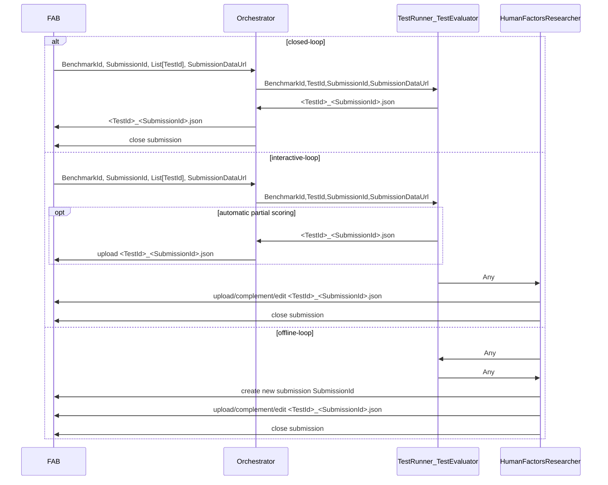

# AI4REALNET Validation Campaign Hub Orchestrator

AI4REALNET Campaign Hub Orchestrator integrates with Validation Campaign Hub (aka. FAB).

This repo contains:

- blueprint for domain-specific orchestrators
- FAB Client Lib to upload results from Python code in the orchestrator
- the domain-specific orchestrator and test runner implementations

## Organization and Responsibilities

1. The campaign benchmarks are set up in the Validation Campaign Hub by domain-specific project managers (TU Delft, RTE, Flatland) together with FLATLAND IT administrator.
2. The domain-specific orchestrators are configured and deployed by the domain-specific IT administrators: see `orchestrator.py` in the blueprint
3. Experiments (Test Runners, Test Evaluator) are implemented by KPI Owners: see `test_runner_evaluator.py` in the blueprint.
4. Experiments are carried out by Algorithmic Researchers, Human Factors Researchers and results are uploaded as a submission to FAB.

## Experiment Workflows

* **offline-loop**: manually upload your test results (JSON) via
  * FAB UI
  * FAB REST API using Python FAB Client Lib
* **closed-loop**:
  * Algorithmic Researcher starts experiment from hub
  * Orchestrator uploads results (JSON) to hub and closes submission
* **interactive-loop**:  manually upload your test results (JSON) via
  * Human Factors Researcher starts experiment from hub
  * orchestrator uploads results (JSON) to hub
  * Human Factors Researcher complements submission manually via FAB UI or Python CLI
  * Human Factors Researcher closes submission manually

## Architecture

Arrows indicate information flow and not control flow.



## TL;DR;

### First Demo

Make a submission:

```shell
python -m pip install -r requirements.txt
python demo.py
```

### Start Domain-Specific Orchestrator for Interactive-Loop and Closed-Loop Experiments

In your domain-specific infrastructure:

The following command loads the `orchestrator` module from `orchestrator.py` and starts a worker pool of size 5 (`concurrency` option):

```shell
export BENCHMARK_ID=
export BROKER_URL=
export BACKEND_URL=
export CLIENT_SECRET=
export TOKEN_URL=
python -m celery -A orchestrator worker -l info -n orchestrator@%n --soft-time-limit  600 --time-limit 720 --concurrency 5 -Q ${BENCHMARK_ID}
```

See https://docs.celeryq.dev/en/stable/reference/cli.html#celery-worker for the available options to start a Celery worker.

### Upload your Results to Campaign Hub with Python FAB Client Lib

```shell
cat results.json

curl -X PUT .... 
```

Generate FAB Clientlib from OpenAPI Specification
--------------------------------------------------
[OpenAPI Specification](https://swagger.io/docs/specification/v3_0/) (formerly Swagger Specification) is an API description format for REST APIs.
An OpenAPI file allows you to describe your entire API, including available endpoints, operation parameters Input and output for each operation authentication methods, contact information, license, terms of use, and other information.
API specifications can be written in YAML or JSON. The complete OpenAPI Specification can be found on:
[OpenAPI 3.0 Specification](https://github.com/OAI/OpenAPI-Specification/blob/master/versions/3.0.4.md)

[OpenAPI Generator CLI](https://pypi.org/project/openapi-generator-cli/) is used to generate FAB API client libraries:

1. Copy `openapi.json` from `ts/backend/src/swagger/swagger.json` from a FAB backend build.
2. Run

```
python -m pip install openapi-generator-cli
openapi-generator-cli generate -i openapi.json -g python --package-name fab_clientlib
```

Configuration:

* https://github.com/OpenAPITools/openapi-generator/tree/master?tab=readme-ov-file#3---usage
* https://github.com/OpenAPITools/openapi-generator/blob/master/docs/generators/python.md
* https://github.com/OpenAPITools/openapi-generator/blob/8d8e3ddf16f2e79c24faf50fb3436b8f545d852f/modules/openapi-generator/src/main/resources/python/setup.mustache
